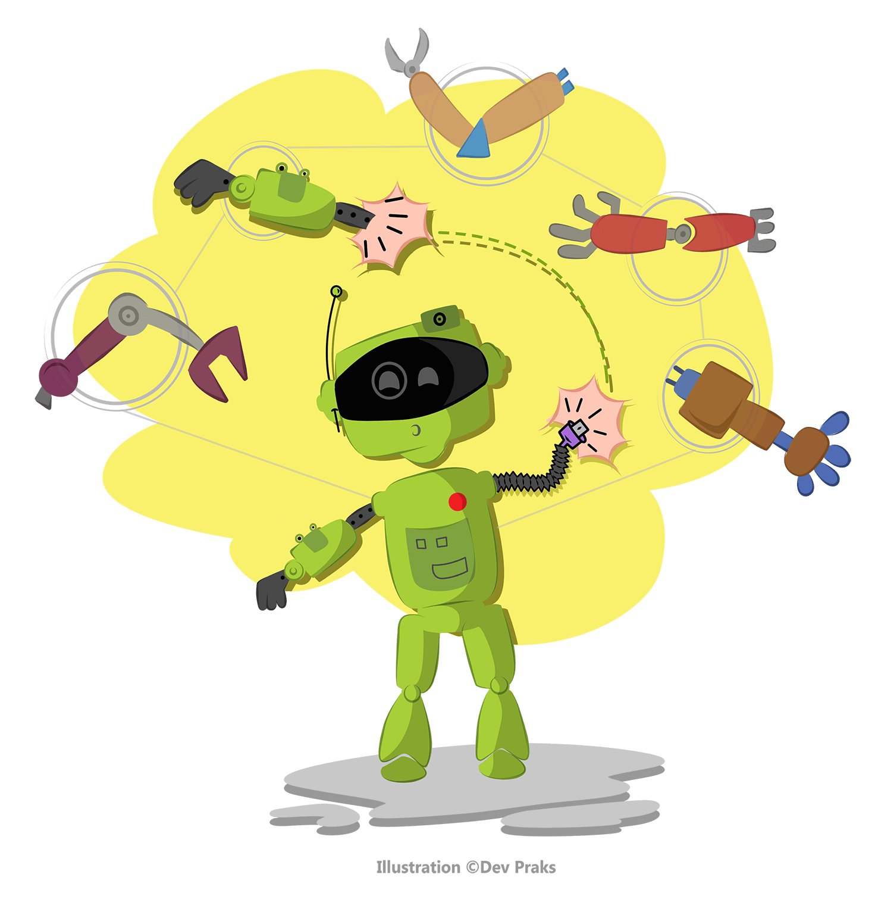
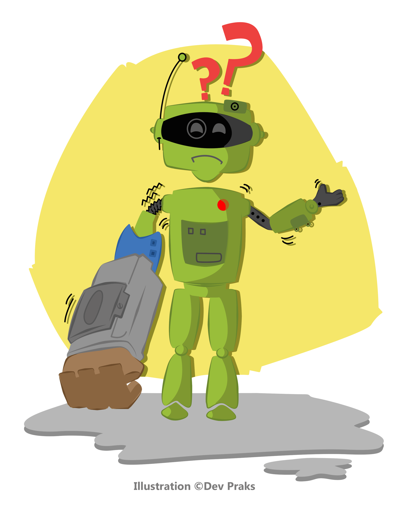

# DeluxeInjection :syringe:

[](https://travis-ci.org/k06a/DeluxeInjection)
[](http://codecov.io/github/k06a/DeluxeInjection?branch=master)
[](http://cocoapods.org/pods/DeluxeInjection)
[](https://github.com/Carthage/Carthage)
[](http://cocoapods.org/pods/DeluxeInjection)
[](http://cocoapods.org/pods/DeluxeInjection)

[](http://cocoapods.org/pods/DeluxeInjection)
[](http://cocoapods.org/pods/DeluxeInjection)


## Features

1. Auto-injection as first-class feature
2. Objective-C **class** properties support
3. Both **value-** and **getter-/setter-** injection supported
4. Inject both **ivar**-backed and `@dynamic` properties (over association)
5. Easily access **ivar** and original method implementation inside injected method

## Table of contents

1. [Concepts](#concepts)
2. [Auto Injection](#auto-injection)
3. [Lazies Injection](#lazies-injection)
4. [Settings Injection](#settings-injection)
5. [Performance and Testing](#performance-and-testing)
6. [Installation](#installation)

## Concepts

The main concept of DeluxeInjection library is explicit injection of marked properties. Properties can be marked with protocols, thats why integral (non-object) properties are not supported.

DeluxeInjection have minimal API and most interesting features are implemented like separated plugins. You can easily develop your own plugins, just looking at some existing: `DIInject`, `DILazy`, `DIDefaults`, `DIAssociate`.

Due DeluxeInjection architecture most plugins works by enumeration all properties of all classes. Thats not very optimal to use with several plugins, thats why `DIImperative` plugin was implemented, and all other plugins now support `DIImperative` plugin. It collects all injectable properties of all classes and provide you a block to apply all necessary injections in imperative format. This plugin is used to be default usage of DeluxeInjection.

## Auto Injection



Here is basic example of injection value by class and protocol and getter injection:
```objective-c
@interface MyClass : NSObject

@property (nonatomic) Settings<DIInject> *settings;
@property (nonatomic) id<Analytics,DIInject> *analytics;
@property (nonatomic) NSMutableArray<UIVIew *><DIInject> *items;

@end
```

Create some instances to be injected:
```objective-c
Settings *settings = [UserDefaultsSetting new];
Analytics *analytics = [CountlyAnalytics new];
```

Inject instances and blocks to properties:
```objective-c
[DeluxeInjection imperative:^(DIImperative *lets) {

    // Inject value by class
    [[[lets inject] byPropertyClass:[Settings class]]
                    getterValue:settings];
    
    // Inject value by property protocol
    [[[lets inject] byPropertyProtocol:[Analytics class]]
                    getterValue:analytics];
    
    // Inject getter by property class
    [[[lets inject] byPropertyClass:[NSMutableArray class]]
                    getterBlock:DIImperativeGetterFromGetter(DIGetterMake(^id (id target, id *ivar) {
        if (*ivar == nil) {
            *ivar = [NSMutableArray array];
        }
        return *ivar;
    }))];
}];
```

You can inject value, getter and setter blocks. There are some functions to simplify getter (same for setters plus additional argument `value`) block definitions:
- `DIGetterMake` with block arguments: target and \*ivar
- `DIGetterIfIvarIsNil` with block arguments: target
- `DIGetterWithOriginalMake` with block arguments: target, \*ivar and original getter pointer

## Lazies Injection


Do you really like this boilerplate?

```objective-c
@interface SomeClass : SomeSuperclass

@property (nonatomic) NSMutableArray *items;

@end

@implementation SomeClass

- (NSMutableArray *)items {
    if (_items == nil) {
        _items = [NSMutableArray array];
    }
    return items;
}

@end
```

Just one keyword will do this for you:

```objective-c
@interface SomeClass : SomeSuperclass

@property (nonatomic) NSMutableArray<DILazy> *items;

@end
```

Of course this will work for generic types:

```objective-c
@property (nonatomic) NSMutableArray<NSString *><DILazy> *items;
@property (nonatomic) NSMutableDictionary<NSString *, NSString *><DILazy> *items;
```

This all will be injected after calling `injectLazy`:

```objective-c
[DeluxeInjection imperative:^(DIImperative *lets) {
    ...
    [lets injectLazy];
    ...
}];
```

## Settings Injection

Wanna achieve this behavior with less boilerplate code?

```objective-c
@interface SomeClass : SomeSuperclass

@property (nonatomic) NSString *username;

@end

@implementation SomeClass

- (NSString *)username {
    return [[NSUserDefaults standardUserDefaults] stringForKey:@"username"];
}

- (void)setUsername:(NSString *)username {
    return [[NSUserDefaults standardUserDefaults] setValue:username forKey:@"username"];
}

@end
```

Just use `<DIDefaults>` or `<DIDefaultsSync>` protocols on property declaration:

```objective-c
@interface SomeClass : SomeSuperclass

@property (nonatomic) NSString<DIDefaults> *username;

@end
```

Injections are made by calling `injectDefaults`:

```objective-c
[DeluxeInjection imperative:^(DIImperative *lets) {
    ...
    [lets injectDefaults];
    ...
}];
```

If something can not be stored directly to NSUserDefault it can be archived, just use `DIDefaultsArchived` or `DIDefaultsArchivedSync` protocols.

There are some extended versions of `injectDefaults` methods to provide key generator and use different `NSUserDefaults` instance:
- `injectDefaultsWithKeyBlock:`
- `injectDefaultsWithDefaultsBlock:`
- `injectDefaultsWithKeyBlock:injectDefaultsWithKeyBlock:`

## Force injection



**!!!Warning `DIForceInject` plugin can't be used in `DIImperative` manner and should be used in separate way.**

You can force inject any property of any class:

```objective-c
@interface TestClass : SomeSuperclass

@property (nonatomic) Network *network;

@end
```

Even without any protocol specification using `forceInject:` method:
```objective-c
Network *network = [Network alloc] initWithSettings: ... ];
[DeluxeInjection forceInject:^id(Class targetClass,
                                 NSString *propertyName,
				 Class propertyClass,
				 NSSet<Protocol *> *protocols) {
				 
    if ([target isKindOfClass:[TestClass class]] &&
        propertyClass == [Network class]) {
	
    	return network;
    }
    return [DeluxeInjection doNotInject]; // Special value to skip injection
}];
```

Specified block will be called for all properties of all classes (exclude properties conforming any `DI***` protocol) and you should determine which value to inject in this property, or not inject at all. You are also able to use method `forceInjectBlock:` to return `DIGetter` block instead of value to provide injected getter.

## Performance and Testing

Single time enumeration of 100.000 properties in 40.000 classes with injecting 150 properties tooks 0.082 sec on my `iPhone 6s` in `DEBUG` configuration. Performance will not decrease in future versions, it is one of first-class feature of the library to be super-performant. You can find some performance test and other tests in Example project. I am planning to add as many tests as possible to detect all possible problems. May be you wanna help me with tests?

## Installation

To run the example project, clone the repo, and run `pod install` from the Example directory first.

DeluxeInjection is available through [CocoaPods](http://cocoapods.org). To install it, simply add the following line to your Podfile:

```ruby
pod 'DeluxeInjection'
```

Or, if you’re using [Carthage](https://github.com/Carthage/Carthage), simply add DeluxeInjection to your `Cartfile`:

```
github "k06a/DeluxeInjection"
```

## Author

Anton Bukov
k06aaa@gmail.com
https://twitter.com/k06a

## License

DeluxeInjection is available under the MIT license. See the LICENSE file for more info.

## Contribution

– Wanna really help to project?<br/>
– Help me to add more test and divide them by plugins.

– Found any bugs?<br/>
– Feel free to open issue or talk to me directly [@k06a](https://twitter.com/k06a)!

Contribution workflow:<br/>
1. Fork repository<br/>
2. Create new branch from master<br/>
3. Commit to your newly created branch<br/>
4. Open Pull Request and we will talk :)
